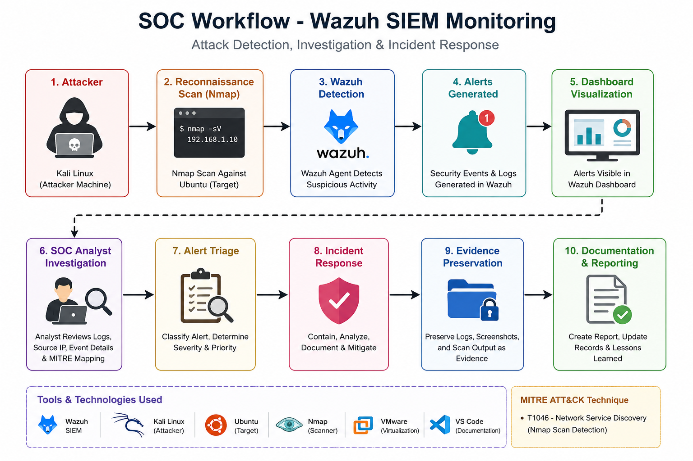

# SOC Analyst Week 2 Project

## Objective
This project demonstrates SOC operations including monitoring, alert detection, alert triage, incident response, evidence preservation, and reporting using Wazuh SIEM and Kali Linux.

---

# Tools Used

- Wazuh SIEM
- Kali Linux
- Ubuntu
- VMware Workstation
- VS Code
- GitHub
- Nmap
- Metasploit Framework
- Draw.io

---

# Project Topics Covered

1. Alert Priority Levels
2. Incident Classification
3. Incident Response
4. Alert Triage
5. Evidence Preservation
6. Capstone SOC Simulation

---

# Environment Setup

| Machine | Purpose |
|---------|----------|
| Ubuntu | Wazuh SIEM Server |
| Kali Linux | Attacker Machine |
| VMware | Virtualization |
| VS Code | Documentation |

---

# Activities Performed

## 1. Wazuh Installation
- Installed Wazuh SIEM on Ubuntu
- Accessed dashboard using browser
- Monitored security events

## 2. Security Event Monitoring
- Viewed alerts inside Wazuh dashboard
- Reviewed logs and agent activity
- Generated security event screenshots

## 3. Alert Triage
- Classified alerts based on severity
- Reviewed suspicious activity
- Documented findings

## 4. Incident Classification
- Categorized incidents using MITRE ATT&CK
- Added metadata and investigation details

## 5. Incident Response
- Followed SOC response lifecycle
- Preparation
- Identification
- Containment
- Recovery
- Lessons Learned

## 6. Evidence Preservation
- Preserved screenshots and logs
- Stored monitoring evidence
- Documented investigation workflow

## 7. Reconnaissance Simulation
- Used Nmap from Kali Linux
- Simulated network scanning activity
- Reviewed alerts generated in Wazuh

## 8. Metasploit Simulation
- Used msfconsole for attack simulation testing
- Performed security testing in Kali Linux

---

# MITRE ATT&CK Techniques

| Technique ID | Description |
|--------------|-------------|
| T1046 | Network Service Discovery |
| T1190 | Exploit Public-Facing Application |
| T1110 | Brute Force |

---

# SOC Workflow

1. Attack Simulation
2. Detection
3. Alert Generation
4. SOC Investigation
5. Alert Triage
6. Incident Response
7. Evidence Preservation
8. Documentation & Reporting

---

# Screenshots

Screenshots are available inside the `Screenshots` folder.

Examples:
- Wazuh Dashboard
- Security Events
- Nmap Scan
- Metasploit Console
- Ubuntu Monitoring

---

# Diagrams

SOC workflow diagram added inside the `Diagrams` folder.

## SOC Workflow Diagram

---

# Reports

Final report available inside the `Reports` folder.

---

# Conclusion

This project successfully demonstrated SOC monitoring, alert detection, alert triage, investigation, evidence handling, and reporting using Wazuh SIEM in a virtual lab environment.

---

# Author

Chetan Malik